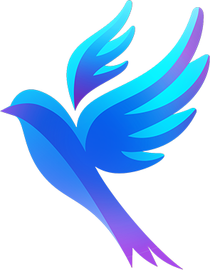

# Синяя птица  

## Содержание

- [Картина первая](#Картина-первая)

- [Картина вторая](#Картина-вторая)

  

## Картина первая

В вагон заходят Митиль и Тильтиль. В руках чемоданы. Находят свое место возле окна. Устало опускаются на сиденья. 

— *Митиль.*  Вот, так встречаем новый год...

— *Тильтиль.*  Митиль, не все так плохо. Меня исключили только на год.

— *Митиль.* И все равно это нечестно… Выселить под самый новый год, без предупреждения. И ты совсем не виноват в этой истории.

— *Тильтиль.*  Поработаю с отцом на лесопилке. Накоплю  денег. Вернусь и доучусь. Ну, веселей,  посмотри,  за окном празднуют… Смотри как светится. Здорово. Такие нарядные. Музыка, шампанское. 

— *Митиль.* Эх… и шампанское пропускаем. 

— *Тильтиль.* Подумаешь —  шампанское… (пауза) .. Давай как в детстве..

Митиль хихикает, встает..

— *Митиль. (делая реверанс)* Рада вас приветствовать месье Тильтиль. 

— *Тильтиль. (с ответным реверансом)*  Позвольте, мадмуазель Митиль, предложить вам бокал воздушного новогоднего шампанского. 

— *Митиль.* О, благодарю вас. Присаживайтесь же к нашему новогоднему столу. У нас тут пироженные, клубничный торт, яблочный компот.  А посмотрите какая у нас елка (указывает на окно).  

— *Тильтиль.* Предлагаю тост! За новый год! И за сестру, которая в праздничный вечер готова бросить все и паковать мои чемоданы ! 

В этот момент заходит дама. В руках у нее клетка с кошкой. Она держит ее на вытянутой вперед руке  защищая. Кошка шипит и громко мяукает. Сразу за ней появляется мужчина, держа собаку на руках и прикрывая ее телом. Собака лает на кошку. 

— *Дама.* Держите на поводке свое животное. Наденьте на него намордник. 

— *Мужчина.* Ваша кошка первая напала.  Ничего бы не было если бы вы ее не выпустили из клетки.

— *Дама.* Пропустите. Вы мне мешаете. В новогоднюю ночь я должна толкаться и запирать клетки. Ну уж нет.  ( Проходит занимает свое место. )

Мужчина молча занимает свое место. Начинает раскладывать чемоданы. Собака внизу рычит на кошку.

—*Мужчина.*  Тило, успокойся. Лежать. Тихо.

Заходит  крупный Старик с большим мешком за плечами и останавливается в проходе ища свое место. 

За Стариком появляется Джентельмен во фраке с цилиндром. Под фраком накрахмаленная белая рубашка со стоячим воротником, лицо бледное.

Старик не замечает что мешает и медлит пытаясь прочесть номер места на билете и на сиденьях, близоруко щурится. 

 Джентельмен пренебрежительно осматривает старика. 

— *Дженетельмен. (презрительно)* Позвольте.

— *Старик. (отступая в сторону)*  Прошу вас, проходите. Извините. 

Джентельмен, продолжая осматриваться вокруг, проходит и садится на свое место. Старик тоже находит свое место, садится начинает разбирать мешок.

Входит Проводница с подносом. На нем стакан чая и сахарные кубики, направляется к Джентельмену. 

— *Проводница.* Вот ваш чай. Четыре кусочка сахара — как заказывали.

Джентельмен молча кивает. Проводница разворачивается собирается уходить. 

— *Митиль. (смущаясь)*  А можно и нам чаю пожалуйста ?

— *Проводница.* Это не включено в ваш билет. Можете доплатить. Вот меню (показывает меню).

— *Тильтиль (рассматривая цены и неловко глядя на Митиль).* Спасибо, не надо. Мы как раз собирались спать. Ведь так, Митиль ?

— *Митиль.*   Да,  точно, я забыла… (вздыхает с досадой)

Тильтиль и Митиль устраиваются поудобнее чтоб уснуть. Проводница уходит. 

— *Джентельмен. (попивая чай и откусывая кусочек сахара)* Очень даже зря отказываетесь.  Этот чай и сахарные кубики — самое большое удовольствие которое можно получить в дороге. Я собственно только ради этого в поезде и езжу. Ностальгия.

— *Митиль.* Спасибо, но очень уж спать хочется. 

— *Старик.* И правильно что не взяли. Вдесятеро платить. У меня вот всегда с собой кусок хлеба в мешочке именно для таких случаев. Хотите? С радостью поделюсь. 

— *Тильтиль.* Спасибо большое. Может утром. Спокойной ночи. 

Свет плавно гаснет. Освещенной остается только часть сцены с Тильтиль и Митиль. Освещение мягкое. Остальные персонажи в затемнении принимают спящие позы. 

— *Тильтиль. (бредя во сне)*  Да, хорошо, Митиль …. не будем рассказывать родителям. … … … Кто-нибудь видел синюю птицу… Кто-нибудь видел синюю птицу…. ?  (затихая и засыпая)

Свет гаснет. Голос Тильтиля подхватывает голос Феи звучащий за сценой.

— *Фея. (за сценой приглушенно)* Кто нибудь видел синюю птицу ? 

Фея появляется на сцене. Освещение направлено на Фею и Тильтиля с Митиль,  плавно усиливается. Остальные персонажи спят затемненные. Фея одета как нищенка. Один глаз сощурен, почти закрыт. Осматривается по сторонам, заглядывает под кровати и столы. 

— *Фея.*  Кто нибудь видел синюю птицу ? Ну кто нибудь видел синюю птицу?  Да, я вас спрашиваю… (подойдя к Тилтилю и Митиль). Нет ли у вас синей птицы ?

— *Митиль.* У Тильтиля есть птица.

— *Тильтиль.* Я ее не отдам...

— *Фея.* Это, конечно, веский довод. А где птица? ..

— *Тильтиль (показывая на клетку).* В клетке...

— *Фея (надевает очки и рассматривает птицу).* Я такую птицу и не возьму — она недостаточно синяя. Вам придется пойти поискать ту птицу, которая мне нужна.

— *Тильтиль.* Мы не знаем, где она.

— *Фея.* Я тоже. Потому-то и надо ее искать. Синяя птица мне просто необходима. Я ищу ее для одного человека, он очень болен.

— *Тильтиль.* Что с ним ?

— *Фея.* Трудно понять... Он хочет быть счастливым...

— *Тильтиль.* Ах вот что!..

— *Фея.* Вы знаете, кто я ?..

— *Митиль.* Вы немного похожи на нашу проводницу...

— *Фея (вдруг вспылив).* Ничуть не похожа!.. Ни малейшего сходства!.. Это возмутительно!.. Я — фея Берлиона...

— *Тильтиль.* Ах, очень приятно!.. 

— *Фея.* Вам придется ехать сейчас же.

— *Митиль.* Нам ? А вы с нами не поедете ?

— *Фея.* Мне никак нельзя. Я утром поставила варить суп, а когда я запаздываю, он непременно выкипает… (показывает на потолок, окно в направлении кулис, окно зрительного зала). Куда хотите направиться: сюда, сюда или сюда ?..

— *Тильтиль (робко).* Нельзя ли просто дальше ехать по железной дороге ?

— *Фея (снова вспылив).* Никак нельзя! Отвратительная привычка ездить по проложенной дороге! (Указывает в сторону зрительного зала.) Мы поедем сюда.. Ну?.. Что же вы застыли?.. 

— *Тильтиль.* Мы не готовы к такой дороге. Не знаем куда мы едем. Вдруг нам что-то понадобится ?

— *Фея.* Это не важно. Я вам дам волшебную шапочку. А куда вы ехали ?

— *Митиль.* К родителям. 

— *Фея.* А дедушка с бабушкой ?

— *Митиль.* Умерли. 

— *Фея (задумавшись).* Хотите с ними повидаться ?..

— *Митиль.* Конечно, очень хотим!.. Как нам с ними встретиться ?..

— *Фея.* Я их в кармане не ношу… Но все складывается чудесно: вы с ними встретитесь, когда будете проезжать через Станцию Воспоминаний. Это как раз по дороге к Синей Птице. Четвертый поворот налево. Что вы тут делали до моего прихода ?

— *Митиль.* Хотели попить чаю, играли что пьем шампанское… 

— *Фея.* У вас есть шампанское ?.. Где же оно ?..

— *Тильтиль.* У нас нет. Там на вокзале. 

— *Митиль.* Поглядите — там так празднично!..

— *Фея.* Так веды это другие пьют, а не вы!..

— *Тильтиль.* Да, но нам все видно...

— *Фея.* И ты не завидуешь ?..

— *Тильтиль.* А чему завидовать ?..

— *Фея.* Тому, что они с вами не делятся. По-моему, это очень дурно.

— *Тильтиль.* Они нас не знают. У них веселье, им не до нас. (смотрит в окно) Как же там хорошо… (вздыхает)

— *Фея.* У тебя не хуже.

— *Тильтиль.* Ну да!.. Выселили из общежития под новый год. Ночевать негде — едем к родителям. Даже на чае экономим. Не хуже...

— *Фея.* Никакой разницы, только ты этого не видишь...

— *Тильтиль.* Я хорошо вижу, у меня отличное зрение.

— *Фея (вдруг вспылив).*  А я говорю, что ты ничего не видишь!.. Вот, например, какою я тебе представляюсь?.. Какая я, по-твоему?..

Тильтиль сконфуженно молчит.

— *Фея.* Что же ты? Отвечай!.. Вот я сейчас проверю, как ты хорошо видишь!.. Красива я или уродлива ?..

Тильтиль еще больше конфузится и молчит.

— *Фея.* Почему же ты не отвечаешь ?.. Молода я или стара?.. Румяна или бледна ?.. Может быть у меня горб ?..

— *Тильтиль (стараясь выразиться мягче).* Нет, что вы, горб у вас небольшой!..

— *Фея.* А по выражению твоего лица можно заключить, что огромный… Нос у меня крючком, левый глаз выколот ?..

— *Тильтиль.* Нет, нет, Я этого не говорил… А кто вам его выколол ?..

— *Фея.* Никто мне его не думал выкалывать!.. Дерзкий мальчишка!.. Противный мальчишка!.. Он еще красивее, чем правый. Больше и яснее. Цвет его — небесно голубой... А вот мои волосы!.. Золотистые, как спелые колосья… Как самородное золото!.. Они у меня такие густые, что даже голове тяжело… Они падают волнами.. Следи за моими руками.. (Вытаскивает из-под чепца две жидкие пряди сшдых волос.)

— *Тильтиль.* Нет, нет, те ваши пряди, что на виду, я различаю ясно...

— *Фея.* Надо быть смелым, надо уметь различать и те, что не на виду!.. Странный народ эти Люди!.. Когда Феи вымерли. Люди ослепли, но они даже не замечают этого… Хорошо, что я ношу всегда с собой то, что может зажечь угасшее зрение.. Что я достаю из мешка?.. 

— *Митиль.* Какая хорошенькая зеленая шапочка!.. А что это у нее блестит на пряжке ?.. 

— *Фея.* Волшебный алмаз, он возвращает зрение.

— *Тильтиль.* Ах вот что!.. 

— *Фея.* Да. Сперва надо одеть шапочку, а затем осторожно повернуть алмаз справа налево — вот так, понимаешь ?.. Алмаз надавливает на шишку на голове — про эту шишку никто не знает, — и глаза открываются...

— *Тильтиль (с недоверием).* Глаза открываются ?..

— *Фея.* Да — ведь алмаз чудодейственный.. Ты сейчас же начинаешь видеть то, что заключают в себе  различные предметы, например душу хлеба, вина, перца...

— *Митиль (стоя возле спящего Джентельмена и взяв кусочек сахара).* И душу сахара тоже ?

— *Фея (вдруг рассердившись).* Ну разумеется!.. Терпеть не могу глупых вопросов… Душа перца не менее интересна чем душа сахара… Вот — это все что я могу дать чтобы помочь вам найти Синюю Птицу…  (одевает шапочку на Тильтиля).  Кольцо невидимка и ковер самолет вам бы больше пригодились… но я потеряла ключ от шкафа, в котором они у меня хранятся… 

— *Тильтиль (колеблется, но позволяет одеть шапочку).* Это какая то несуразица. 

— *Фея.* Нужно повернуть алмаз и сам все увидишь. Вот, один поворот, второй… (поворачивает алмаз на голове Тильтиля)..

Отделения плацкарта где находятся Мужчина с Собакой и Дама с Кошкой занавешено — у каждого свое отделение. За занавесками загорается свет. В отделении Дамы появляется тень Кошки, за занавеской Мужчины — тень Собаки. Тени увеличиваются в размере.

Рядом со Стариком поднимается округлый силуэт накрытый бежевой простыней, рядом с Джентельменом — силуэт в форме куба накрытый белой простыней. Фея скидывает накидку нищенки и перевоплощается.

— *Тильтиль (испуганно).* Нет, нет этого не может быть — это сон. (срывает с себя шапочку, бросает на пол).  Я сейчас ущипну себя и проснусь. (Зажмуривается, щипает себя за руку, при этом нечаянно наступает на шапочку).

По сцене начинают бегать огни света, мелькать тени. Фея подбегает, отталкивает Тильтиля, поднимает шапочку.

— *Фея.* Что ты наделал!.. Ты наступил на алмаз!..  Сейчас же одень! (быстро надевает шапочку на Тильтиля и поворачивает алмаз два раза). Какой неуклюжий!..

Бегающий свет остановиливается, тени исчезают. Бежевая простынь падает накрывает спящего Старика. Белая простынь накрывает Дженетельмена. Стены освещают разноцветные фонари.

— *Тильтиль (открывая глаза и изумленно оглядываясь).* Это не сон ? 

— *Фея (ворча).* Да ты еще слепее остальных. Не сон!.. Что ты наделал ?… 

— *Тильтиль (разворачиваясь к Фее).* Это вы?.. Фея Берлиона ?  Что происходит ? 

— *Фея (осматривая простынь накрывающую Джентельмена).* Ты перемешал души…  

— *Тильтиль (изумленно).* Души ?… Почему стены такие светлые, будто из драгоценных камней ?

— *Фея (переходя к месту Старика и рассматривая простынь накрывающую его).* Все камни одинаковы, все драгоценны, но человек видит лишь некоторые из них (продолжает укорять).

Занавеска отделения мужчины отодвигается. Из-за нее пятясь выходит Мужчина (теперь будем называть его Псом). Разворачивается лицом к сцене. В недоумении рассматривает свои руки. Лижет одну руку и опять рассматривает ее. Вдруг очнувшись, начинает рассматривая обнимать себя, ощупывать иногда лизать руку, при этом разговаривая.

— *Пес.* Мое божество!.. Здравствуй, здравствуй, мое божество!.. Наконец-то, наконец-то мне можно говорить! (обнимая себя) Мне столько нужно сказать тебе!.. (продолжая рассматривать себя) Напрасно я лаял и вилял хвостом — ты не понимал меня!.. Но теперь!.. Здравствуй!.. Здравствуй!.. Я люблю тебя!.. Я люблю тебя!… (опять лижет себе руку). Хочешь выкину что-нибудь необыкновенное ?  Хочешь покажу фокус ? Хочешь я пройдусь на задних лапах ? (начинает идти вперед и изумленно рассматривать свои ноги).

— *Митиль (испуганно).* Что с этим господином ?

— *Фея.* Это не господин. Это его Пес. Тило, правильно ? (обращаясь к Псу)

— *Пес (продолжая смотреть на ноги).* Это не мой господин? А где же он ?… Что с ним ?… р-р-р-р (рычит, оскаливается).

— *Фея.* Ваши души поменялись местами. Душа твоего господина сейчас спит в твоем теле, Тило.

— *Пес.* Гав… Давйте скорей его разбудим!..

— *Фея.* Не стоит, Тило. Нынче быть в теле животного очень тяжело. Он еще не скоро проснется. (обращаясь к Тильтилю и Митиль) Вам теперь придется найти Синюю Птицу, чтоб все исправить!..

Из-за знавески второго орделения выходит плавно шагая Дама (теперь будем называть ее Кошка) в руках ее зеркало. Она любуется своим лицом.

— *Кошка (улыбаясь).* Какая хорошенькая… 

Кошка наталкивается на Митиль и снисходительно пробегает по ней взглядом. На секунду задумывается, потом плавно протягивает Митиль руку.

— *Митиль.* Здравствуйте сударыня… (Фее) Кто это ?

— *Фея.* Нетрудно догадаться — это кошка. Если не ошибаюсь, Тиллета? Она тоже поменялась с хозяйкой. 

— *Кошка.* Мяу… Да.. (опять заглядывает в зеркало) Мне нравится это тело.. Я бы в нем осталась… (направляется к Тильтилю, протягивает руку к шапочке) Интересная шапочка... .

— *Пес (отталкивает кошку).* Нужно все вернуть на место. Хозяину там плохо.  Не трогай шапочку!..

— *Кошка.* Милостивый государь, я с вами незнакома… (продолжает рассматривать шапочку)

— *Пес.* А ну отойди... Я тебе покажу.. (начинает гонятся за Кошкой).

— *Фея (грозит Псу и Кошке волшебной палочкой).* Прекратите сейчас же. А то снова лишу вас речи..  

Пес и Кошка останавливаются, расходятся подозрительно глядя друг на друга. Кошка оказывается возле Сахара, Пес возле хлеба. 

— *Пес (принюхиваясь).* Чем то вкусным пахнет…. (подходит обнюхивает ткань накрывающую Хлеб)

— *Кошка (проводя пальцем по накидке сахара и облизывая палец).* А тут сладким...

— *Тильтиль.* Что с этими господами?…

— *Фея.* Это не совсем господа, Тильтиль.  В этом господине теперь душа Сахара (указывает на Джентельмена), а в этом (указывает на старика присматриваясь) душа Хлеба. Ты их тоже поменял.

— *Митиль.* Они теперь будут все время спать?..

— *Фея.* Нет, отчего же, они уже давно проснулись. Вот только боятся на свет смотреть. Большую часть своей жизни они провели закрытыми в темноте. Их тоже придется взять с собой... Понадобится помощь Души Света.  Тильтиль а ну посмотри внимательно на лучи света проникающие в дверь, вон там. 

— *Тильтиль.* Я не хочу больше никого менять!..

— *Фея (ворчливо).* Тогда не наступай больше на алмаз... Нужно просто посмотреть и захотеть увидеть душу предмета. 

Тильтиль подходит ближе к ярко освещенному участку возле двери, сосредотачивается. На освещенном месте появляется Душа Света в белом платье со светящимися огоньками. 

— *Митиль.* Как красиво...

— *Тильтиль (неловко).* Здравствуйте... Нам нужна …

— *Душа Света (приветливо).* Я знаю, я за вами давно наблюдаю… конечно, я вам помогу...

Душа Света проходит мимо Сахара  легонько дотрагивается до него пальцем. Подходит к Хлебу и так же дотрагивается до него. 

Сахар поднимается, накидка съезжает. Становится видно его бледное лицо с прикрытыми рукой глазами.  Сначала осторожно раздвигает пальцы и смотрит сквозь них. Убедившись что не страшно, отводит руку от глаз рассматривает ее, задумывается на секунду, потом засовывает четыре пальца себе в рот. 

— *Сахар (сконфуженно вынимая руку).* Я думал — я вкуснее...

— *Хлеб (представительно).* Хм.. хм.. я всегда считал, что вкус сахара преувеличен… (довольно гладит себя по животу). Не те объемы для хорошего вкуса… (кусает себя за кулак, удивляется) Я тоже не чувствую вкуса... 

Сахар расстроенно опускает голову. 

— *Сахар.* Я был таким ценным элементом. Меня так все любили. 

— *Душа Света.* Не расстраивайтесь. Пока ваши души в телах людей, никто не сможет по настоящему ощутить вкус Сахара или Хлеба. Но когда найдете Синюю Птицу, все вернется на свои места. 

— *Фея.* Ну пора ехать. Сначала — ко мне домой. Мне как раз нужно проверить суп.

Фея взмахивает волшебной палочкой. Загорается яркий свет. Вагон раздвигается. Свет резко гаснет становится мягким. Все кроме Феи и Души Света падают на пол. Хлеб съезжает на стул. Вокруг Души Света остается яркий круг света. Душа Света проводит рукой и свет возвращается.

— *Хлеб.* Ух… Как на дрожжах… 

— *Пес.* Гав!.. Здорово!.. Еще, еще разок. 

— *Кошка (смотрится в зеркало, поправляет прическу.)* Ничего особенного.. Как спрыгнуть с крыши...

— *Сахар (жалобно).* Меня кажется укачало..  хочется в чем нибудь раствориться. 

— *Пес (принюхиваясь).* Не пойму чем пахнет.

— *Фея (тоже принюхавшись).* Как раз во время, нужно приправить суп. Волшебство не терпит неточности (и ворчливо обращаясь к Тильтилю) и неуклюжести. Ладно, Тильтиль, Митиль, пойдемте со мной, расскажу вам про дорогу. (разворачиваясь к Душе Света) Будь добра посвети. 

Душа Света уходит со сцены за ней Фея, Тильтиль и Митиль.

— *Пес (принюхиваясь и приближаясь к выходу).* Какой необычный запах. Р-р-р… Как интересно… (тоже выбегает из вагона)

## Картина вторая

Кошка проходит к выходу убеждается что все ушли далеко и не слышат ее. Разворачивается к Сахару и Хлебу.  Сахар в этот момент прячет сахарные кубики в карман.

— *Кошка.*  Очень хорошо… Мы как раз сможем обсудить наше бедственное положение. Надеюсь вы все понимаете ?..

— *Хлеб (важно).* Да, конечно… Я все понимаю..  Ведь я всему голова.. (гладит себя по животу) 

— *Кошка (задумавшись на секунду).* Kонечно... ты такой м-у-у-дрый..  ты даже сможешь понять что Фея говорит там людям. Да ? 

— *Хлеб (гордо).*  Смогу понять… отчего же нет...

— *Кошка.*  Как ты м-у-у-дрр… иди..  сходи, послушай…

Хлеб смущенный и радостный встает грузно переваливаясь с ноги на ногу начинает идти к выходу. Вдруг останавливается, возвращается и забирает буханку хлеба лежащую на столе с собой. 

— *Хлеб (неловко).* Так как-то привычнее… (выходит)

Кошка плавно двигаясь  вокруг сахара. 

— *Кошка.* Ну вы то, с вашим утноченным вкусом, понимаете, что нам нельзя позволить им найти Синюю Птицу. 

— *Сахар (слащаво).* Благодарю вас. Так приятно поговорить с душой со вкус-с-с-ом. Очень приятно...

— *Кошка.* Если они найдут Синюю Птицу...

Кошка не успевает договорить, в вагон влетают несколько хлебных караваев и вслед за ними на спину выкатывается Хлеб. Хлеб переворачивается на четвереньки, начинает ползать собирать караваи. 

— *Хлеб (улыбаясь и держа в руках каравай).* Вот… удалось захватить..

— *Кошка.* А удалось ли что-то услышать?..

— *Хлеб (гордо).* О да.. Фея как раз собиралась забросить эти караваи в котел. Тогда я выразил протест от имени всего нашего почтенного сословия. И тогда она сказала, да, я очень четко услышал: "Как не стыдно подслушивать?…", потом несколько раз ударила меня палочкой по голове и по животу.. потом я все понял… и оказался тут… И, вот, удалось захватить.. (довольно поднимает еще один каравай)

— *Кошка.* Да… Много услышал...

Тут кубарем вкатывается Пес. Быстро встает. Довольно потирает бока. 

— *Пес.* Ух.. Здорово… Унюхал почти из котла.. Такой вкусный запах.. И палочка что надо… (потирая лоб).  А что у вас здесь ?

— *Кошка.* А у нас здесь бедственное положение, если ты еще не заметил. Речь идет о нашей дальнейшей судьбе. Вы разве не слышали, что Фея сказала ? В конце путешествия все станет как прежде… Мы лишимся речи.. Человек снова станет безгранично властвовать  над нами.

— *Сахар.* Браво, браво… Кошка поднимает правильный вопрос...

— *Кошка.* Слушайте дальше.. Моя близкая подруга, Душа Ночи, хранительница тайн бытия, мне недавно все рассказала. Все наши братья, — Животные, Предметы, Стихии — обладают душой, которую человек все еще не разгадал. Только благодаря этому мы еще не совсем утратили независимость. Но если он найдет Синюю Птицу, он постигнет все и окончательно поработит нас… Так что, в наших интересах любой ценой добиться того чтобы они не нашли Синюю Птицу, хотя бы для этого пришлось пожертвовать жизнью… (задумывается).. ну, скажем, людей...

— *Пес (в негодовании).* Что ты говоришь ?.. А ну, повтори! Я должно быть, ослышался.

— *Хлеб.* Замолчите!.. Я вам слова не давал!.. Я глава собрания.. 

— *Сахар (примирительно).* Позвольте!.. Не будем ссориться… Вопрос очень важный… Нам нужно решить, какие мы должны принять меры...

— *Хлеб.* Я вполне разделяю мнение Сахара и Кошки.

— *Пес.* Ну и дурак!.. Человек — это все!.. Надо его слушаться и исполнять все его желания!.. В этом вся истина.. Я признаю только его!.. Да здравствует Человек!.. Жить и умереть ради моего хозяина!.. Человек — это Божество!..

— *Хлеб.* Я вполне разделяю мнение Пса.

— *Кошка (Псу).* Это еще надо доказать..

— *Пес.* Никаких доказательств!.. Я люблю Человека, вот и все !.. Посмейте только задумать что-нибудь против него — я сначала вас загрызу, а потом пойду к нему и все открою..

— *Сахар (слащаво).* Позвольте!.. Не надо так горячиться… С известной точки зрения, права и та и другая сторона.. Есть доводы и "за" и "против"...

— *Хлеб.* Я вполне разделяю мнение Сахара!..

— *Кошка.* Разве все мы не являемся жертвами чудовищной тирании ?.. Вспомните как было до появления деспота: мы свободно ходили по земле… И что с нами теперь!.. Мы хилые потомки могучих хищников!.. (настороженно поворачивается к двери). Тсс!.. Примем самый невинный вид.. Они возвращаются..

Входят Фея и Душа Света, за ними Тильтиль и Митиль.

— *Фея.* Это еще что такое?.. Что вы там шепчетесь, как заговорщики?.. Пора в путь.. Дальше вас поведет Душа Света… Мою волшебную палочку я передаю ей. (подозрительно глядя на Кошку) Будете ее слушаться, как меня.  

— *Кошка.* Я как раз то самое им говорила, госпожа Фея…  Я их призывала добросовестно слушаться. К сожалению, Пес не давал мне говорить...

— *Пес.* Что такое?.. Ну погоди же ты у меня!.. (хочет броситься на Кошку)

— *Тильтиль (заметив его движение, хватает его за руку).* Тило, не смей!.. Смотри у меня!..

— *Пес.* Человек, ты  мое божество!.. Ты же не знаешь, что она..

— *Тильтиль.* Перестань!..

— *Фея.* Довольно, прекратите!.. Хлеб

